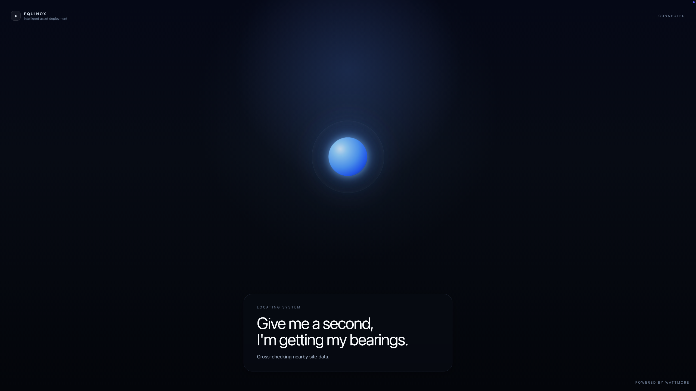
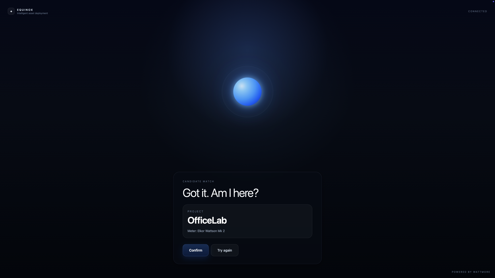

# Equinox: Location-Aware Device Deployment System

Intelligent deployment dashboard for Balena devices with automatic geolocation detection, hardware discovery, and one-click deployment. Includes advanced chat interface for system monitoring and operational insights. Powered by Wattmore.

## Documentation

All documentation is in the [`docs/`](docs/) directory:

| Document | Purpose |
|----------|----------|
| [`docs/AWS_SETUP.md`](docs/AWS_SETUP.md) | **START HERE** — 8-step AWS provisioning guide (console-based, ~30 min) |
| [`docs/README_SETUP.md`](docs/README_SETUP.md) | Quick start overview with architecture and environment setup |
| [`docs/STRUCTURE.md`](docs/STRUCTURE.md) | Complete project layout and file organization reference |
| [`docs/PROJECT_STATUS.md`](docs/PROJECT_STATUS.md) | Implementation checklist and configuration details |
| [`docs/EC2_IMPLEMENTATION_COMPLETE.md`](docs/EC2_IMPLEMENTATION_COMPLETE.md) | Architecture details and testing checklist |
| [`docs/AWS_INTEGRATION_SUMMARY.md`](docs/AWS_INTEGRATION_SUMMARY.md) | AWS infrastructure and cost breakdown |
| [`docs/DEPLOYMENT.md`](docs/DEPLOYMENT.md) | CM4 deployment procedures |
| [`docs/TESTING.md`](docs/TESTING.md) | Test procedures and validation |
| [`docs/PROJECT_SUMMARY.md`](docs/PROJECT_SUMMARY.md) | Original project summary |

## Dashboard Screenshots

**Auto-detection in progress**


**Confirmation with hardware details and site selection fallback**


## Quick Start

1. Deploy to Balena device: `balena push YourFleet`
2. Open device dashboard in browser
3. System auto-detects your location and hardware
4. Confirm the detected site (or select different site from dropdown)
5. Click Confirm to deploy

## What This System Does

**Phase 3: Advanced Chat Interface for System Monitoring**
- Query container logs and system status in natural language
- Monitor all data directories and file freshness
- Get structured JSON data for programmatic access
- Upload and apply new environment variables from CSV files
- Receive detailed holistic system health reports with metrics

**Phase 2: Location-Aware Deployment Dashboard**
- Auto-detects device location and matches to nearest site
- Auto-discovers hardware from Wattmore configurator
- One-click deployment with fallback site selection
- Beautiful cinematic dashboard with smooth UX
- Powered by Balena API and Wattmore integration

**Phase 1: Cloud Deployment Infrastructure** (completed)
- Hardware profile database with CSV caching
- Wattmore API scraper for project discovery
- Secure Balena token storage (env vars or S3)
- Config generator merging hardware + site data

## Project Structure

```
/Users/drb/documents/equinox/
├── docs/                    # All markdown documentation
├── ec2/                     # Cloud deployment runner scripts
├── src/                     # Application code (CM4 dashboard, deployer)
├── components/              # Golden masters (200MB service blueprints)
├── package.json
└── Dockerfile
```

## Key Components

- **`src/services/deployer.js`** — Dual-mode deployment (local or cloud)
- **`src/services/monitor.py`** — System metrics collection and AWS IoT publishing
- **`src/services/systemReportGenerator.js`** — Health report aggregation and narrative generation
- **`src/routes/chat.js`** — Chat API with environment variable upload and system reports
- **`ec2/runner.js`** — Runs on EC2 via Systems Manager
- **`ec2/lambda-handler.js`** — Lambda entry point
- **`ec2/bootstrap.sh`** — EC2 automatic setup

## Chat Interface Capabilities

### Container Log Monitoring
- Query container logs in natural language
- Automatic error and warning extraction
- Real-time status updates from Docker

### Data Directory Monitoring
- Track file freshness across monitored directories
- Monitor activity in /collect_data/meter, /collect_data/tracker, and other key paths
- View human-readable timestamps for most recent files

### Environment Variable Management
- Upload CSV files with KEY,VALUE pairs
- Apply variables to device via Balena API
- Handle variables with embedded commas

### System Health Reports
- Ask "How is my system doing?" to get comprehensive report
- Reports include:
  - CPU usage and trend analysis
  - Memory usage and allocation
  - Storage utilization
  - Container health (running vs. failed)
  - Recent errors and warnings
  - Data freshness across all monitored directories
  - System temperature (if available)
- Reports automatically published to AWS IoT Core on 10-minute schedule

### JSON Data Access
- Structured API endpoints for programmatic access
- System metrics available at `/api/chat/system-report`
- Raw monitoring data cached for quick retrieval

## Status

[COMPLETE] Code complete and ready for AWS provisioning
- IAM roles: Already created
- EC2 + Lambda + API Gateway: Ready to provision
- S3 archival: Enabled for project history
- Chat interface: Fully operational with system monitoring
- AWS IoT publishing: Active and scheduled

## Cost

~$8-12/month (or free with AWS free tier)
- EC2 t2.micro: $7-10
- Lambda: <$1
- API Gateway: ~$0.50

## Next Steps

1. Open [`docs/AWS_SETUP.md`](docs/AWS_SETUP.md)
2. Follow the 8 provisioning steps (takes ~30 minutes)
3. Update CM4 configuration
4. Test end-to-end deployment
5. Enable AWS IoT Core publishing with device credentials
6. Configure monitoring intervals via SYSTEM_REPORT_INTERVAL env var (default 600 seconds)

---

**Repository**: https://github.com/WATTMORE-HUB/equinox  
**Project Status**: Production-ready, AWS infrastructure ready for deployment
